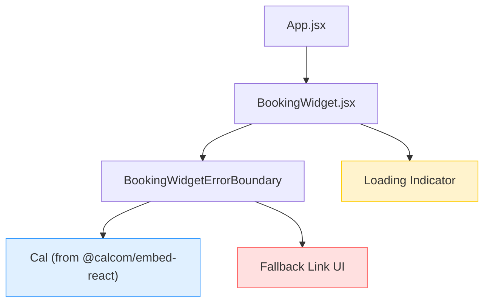

# Design Document — Booking Integration

## Overview

This design describes how to integrate Cal.com's inline scheduling embed into the existing `cal-booking-poc` React 19 + Vite application. The integration wraps the `@calcom/embed-react` package in a `BookingWidget` component that handles loading states, error fallback, and configurable host usernames. Google Calendar synchronization is handled entirely by Cal.com's platform — no custom sync code is needed in the app.

### Key Design Decisions

1. **Single wrapper component**: All embed logic lives in `BookingWidget.jsx` — loading indicator, error boundary, and fallback link. This keeps `App.jsx` clean and makes the widget reusable.
2. **Error boundary for fallback**: A lightweight `BookingWidgetErrorBoundary` class component catches render errors from the Cal.com embed and shows a direct link to the host's Cal.com page.
3. **CSS-only loading indicator**: A simple spinner implemented with CSS keyframes — no extra dependency needed.
4. **Vitest + React Testing Library + jsdom**: Standard React testing stack that runs entirely in-process with no browser or network dependency.

## Architecture



**Data flow:**
1. `App` renders `BookingWidget` with a `calLink` prop (e.g. `"jane/30min"`).
2. `BookingWidget` shows a CSS spinner while the Cal.com iframe initializes.
3. The `Cal` component from `@calcom/embed-react` renders the inline scheduling iframe.
4. If the `Cal` component throws (script blocked, network failure), `BookingWidgetErrorBoundary` catches the error and renders a fallback message with a direct link to `https://cal.com/{calLink}`.

## Components and Interfaces

### BookingWidget

The main integration component. Wraps the Cal.com embed with loading and error handling.

```jsx
// src/components/BookingWidget.jsx
import Cal from "@calcom/embed-react";

/**
 * @param {Object} props
 * @param {string} props.calLink - Cal.com username or event-type slug (e.g. "jane/30min")
 * @param {Object} [props.config] - Optional Cal.com embed config overrides
 */
function BookingWidget({ calLink, config = {} }) { ... }
```

**Props:**

| Prop | Type | Required | Description |
|------|------|----------|-------------|
| `calLink` | `string` | Yes | Cal.com username or `username/event-type` slug |
| `config` | `object` | No | Cal.com embed configuration overrides (theme, layout, etc.) |

**Behavior:**
- Renders a loading spinner initially.
- Renders the `Cal` inline embed inside a `BookingWidgetErrorBoundary`.
- The Cal.com embed fires a `__iframeReady` message when loaded; the component listens for this to hide the spinner.

### BookingWidgetErrorBoundary

A React error boundary that catches errors thrown by the Cal.com embed component.

```jsx
// src/components/BookingWidgetErrorBoundary.jsx

/**
 * @param {Object} props
 * @param {string} props.calLink - Used to build the fallback direct link
 * @param {React.ReactNode} props.children - The Cal embed component tree
 */
class BookingWidgetErrorBoundary extends React.Component { ... }
```

**Behavior:**
- On error: renders a user-friendly message with a link to `https://cal.com/{calLink}`.
- On success: renders children transparently.

### App (updated)

```jsx
// src/App.jsx — updated to use BookingWidget
import BookingWidget from "./components/BookingWidget.jsx";

function App() {
  return (
    <div style={{ maxWidth: 1000, margin: "0 auto", padding: "2rem" }}>
      <h1 style={{ textAlign: "center", marginBottom: "1.5rem" }}>
        Book a Meeting
      </h1>
      <BookingWidget calLink="your-username/30min" />
    </div>
  );
}
```

## Data Models

This feature has no persistent data models within the app. All booking data, calendar events, and availability are managed by Cal.com's platform.

**Configuration values passed through the component tree:**

| Field | Type | Source | Description |
|-------|------|--------|-------------|
| `calLink` | `string` | Prop on `BookingWidget` | Identifies the host and event type on Cal.com |
| `config` | `object` | Prop on `BookingWidget` | Optional embed styling/layout overrides passed to the `Cal` component |

**External data (managed by Cal.com, not the app):**

| Data | Owner | Sync |
|------|-------|------|
| Available time slots | Cal.com | Real-time via embed iframe |
| Booking records | Cal.com | Created on confirmation |
| Google Calendar events | Cal.com ↔ Google | Bidirectional via Cal.com Connected Calendars |


## Correctness Properties

*A property is a characteristic or behavior that should hold true across all valid executions of a system — essentially, a formal statement about what the system should do. Properties serve as the bridge between human-readable specifications and machine-verifiable correctness guarantees.*

### Property 1: calLink prop forwarding

*For any* non-empty string `calLink`, when `BookingWidget` is rendered with that `calLink` prop, the underlying `Cal` component from `@calcom/embed-react` SHALL receive the exact same `calLink` value.

**Validates: Requirements 3.2, 5.3**

### Property 2: Error fallback link correctness

*For any* non-empty string `calLink`, when the `Cal` component throws a render error, the `BookingWidgetErrorBoundary` SHALL render a fallback containing an anchor element whose `href` equals `https://cal.com/{calLink}`.

**Validates: Requirements 3.4, 5.4**

## Error Handling

| Scenario | Handling | User Experience |
|----------|----------|-----------------|
| Cal.com embed script fails to load (network error, ad blocker, CSP) | `BookingWidgetErrorBoundary` catches the render error | Fallback message with direct link to `https://cal.com/{calLink}` |
| Cal.com embed loads but iframe is slow | Loading spinner remains visible until `__iframeReady` message | Visitor sees a spinner, not a blank space |
| Invalid `calLink` prop (empty string) | Cal.com embed will show its own error inside the iframe | No app-level crash; Cal.com handles the error display |
| `calLink` prop not provided | Component should require it; React will warn if missing | Developer-facing warning during development |

## Testing Strategy

### Test Framework Setup

- **Test runner**: Vitest (with `jsdom` environment)
- **Component testing**: React Testing Library (`@testing-library/react`)
- **Mocking**: Vitest's built-in `vi.mock` to mock `@calcom/embed-react`
- **Property-based testing**: `fast-check` library for generating random inputs

### Dependencies to Install

```bash
npm install -D vitest @testing-library/react @testing-library/jest-dom jsdom fast-check
```

### Mock Strategy

The `@calcom/embed-react` package is mocked in all tests to avoid network calls:

```js
vi.mock("@calcom/embed-react", () => ({
  default: (props) => <div data-testid="cal-embed" data-callink={props.calLink} />,
}));
```

This mock renders a simple `div` that exposes the `calLink` prop as a data attribute, making it easy to assert prop forwarding.

### Test Plan

#### Property-Based Tests (fast-check, minimum 100 iterations each)

1. **Property 1 — calLink prop forwarding**
   Tag: `Feature: booking-integration, Property 1: calLink prop forwarding`
   Generate arbitrary non-empty strings, render `BookingWidget` with each, assert the mock Cal element's `data-callink` attribute matches.

2. **Property 2 — Error fallback link correctness**
   Tag: `Feature: booking-integration, Property 2: Error fallback link correctness`
   Generate arbitrary non-empty strings, render `BookingWidget` with a Cal mock that throws, assert the fallback anchor `href` equals `https://cal.com/{calLink}`.

#### Example-Based Unit Tests

3. **Renders Cal embed on mount** (Req 3.1, 5.2)
   Mount `BookingWidget` with `calLink="jane/30min"`, assert the Cal embed element is present.

4. **Shows loading indicator before embed is ready** (Req 6.1)
   Mount `BookingWidget`, assert the loading spinner is visible before the embed signals ready.

5. **Hides loading indicator after embed is ready** (Req 6.2)
   Mount `BookingWidget`, simulate the embed ready event, assert the spinner is removed.

6. **Renders fallback on error with direct link** (Req 3.4, 5.4)
   Mount `BookingWidget` with a throwing Cal mock, assert fallback message and link are visible.

7. **Tests run without network or credentials** (Req 5.5, 5.6)
   Verified implicitly — all tests use mocked Cal component, no network calls.

### File Structure

```
src/
  components/
    BookingWidget.jsx
    BookingWidgetErrorBoundary.jsx
    __tests__/
      BookingWidget.test.jsx
```
